# 👋 Hi, I'm Iries

### 🎓 BSIT Student • 🌐 Aspiring Network Engineer

Building my foundation in **Computer Networking, Cisco Technologies, Systems, and Network Automation.**

My goal is to become a **Network Engineer** through hands-on labs, continuous learning, and real-world troubleshooting.

 

> 💗 **Learn. Build. Break. Troubleshoot. Document. Repeat. 🔧**

---

## 🎯 Career Focus

🌐 **Network Infrastructure** • 🔀 **Switching & Routing** • 📡 **IPv4 / IPv6**  
🧮 **Subnetting** • 🛠️ **Network Troubleshooting** • 🖥️ **Network Administration**  
🐧 **Linux Networking** • 🪟 **Windows Networking** • 🐍 **Python**  
🤖 **Network Automation** • ☁️ **Cloud Networking**

---

# 🛠️ Technologies & Tools

### 🌐 Networking

### 🔵 Cisco

### 💻 Operating Systems

### 🐍 Programming & Automation

### 🔧 Tools

---

# 📊 GitHub Stats

  
  

---

# 🔥 GitHub Streak

  

---

# 🏆 GitHub Trophies

  

---

# 🌐 Networking Journey

🎓 **BSIT Student**
 ↓
 
💻 **IT Fundamentals**
 ↓
 
🌐 **Networking Fundamentals**
 ↓
 
🔵 **Cisco Networking**
 ↓
 
📡 **IPv4 • IPv6 • Subnetting**
 ↓
 
🔀 **Switching • VLANs • Routing**
 ↓
 
🛠️ **Network Troubleshooting**
 ↓
 
🎯 **CCNA**
 ↓
 
🐧 **Linux & Windows Networking**
 ↓
 
🐍 **Python for Network Automation**
 ↓
 
🤖 **Network Automation**
 ↓
 
☁️ **Cloud Networking**
 ↓
 
🌐 **Network Engineer**

---

# 📚 Currently Learning

🌐 Networking Fundamentals  
🔀 Switching & Routing  
📡 IPv4 / IPv6  
🧮 Subnetting  
🛠️ Network Troubleshooting  
🔵 Cisco Networking  
🎯 CCNA Preparation

---

# 🧪 Hands-On Labs

### 📡 Cisco Packet Tracer

- Basic network topologies
- IPv4 & IPv6 configuration
- Subnetting
- Switching & VLANs
- Trunking
- Routing
- DHCP
- SSH
- Network troubleshooting

### 💻 Future Labs

- Linux Networking
- Windows Networking
- Python Network Automation
- Network Automation
- Cloud Networking

---

# 🚀 Projects

| Project | Focus |
|---|---|
| 📡 Cisco Packet Tracer Labs | Networking & Cisco |
| 🧮 IPv4 Subnetting Labs | IPv4 & Subnetting |
| 🔀 VLAN & Switching Labs | Switching & VLANs |
| 🚦 Routing Labs | Routing |
| 🐧 Linux Networking Labs | Linux Networking |
| 🐍 Python Network Automation | Automation |

---

# 🎯 Certifications & Goals

### Current Goal

🔵 **CCNA**

### Future Goals

🐧 Linux Skills  
🐍 Python for Networking  
🤖 Network Automation  
☁️ Cloud Networking  
🌐 Advanced Networking  
💼 **Network Engineer**

---

# 💡 Learning Philosophy

> **Learn the concept.**  
> **Build the lab.**  
> **Break the configuration.**  
> **Troubleshoot the problem.**  
> **Document what I learned.**

### 🌐 Building my networking journey one lab at a time.

**Thanks for visiting my profile! 💗**

